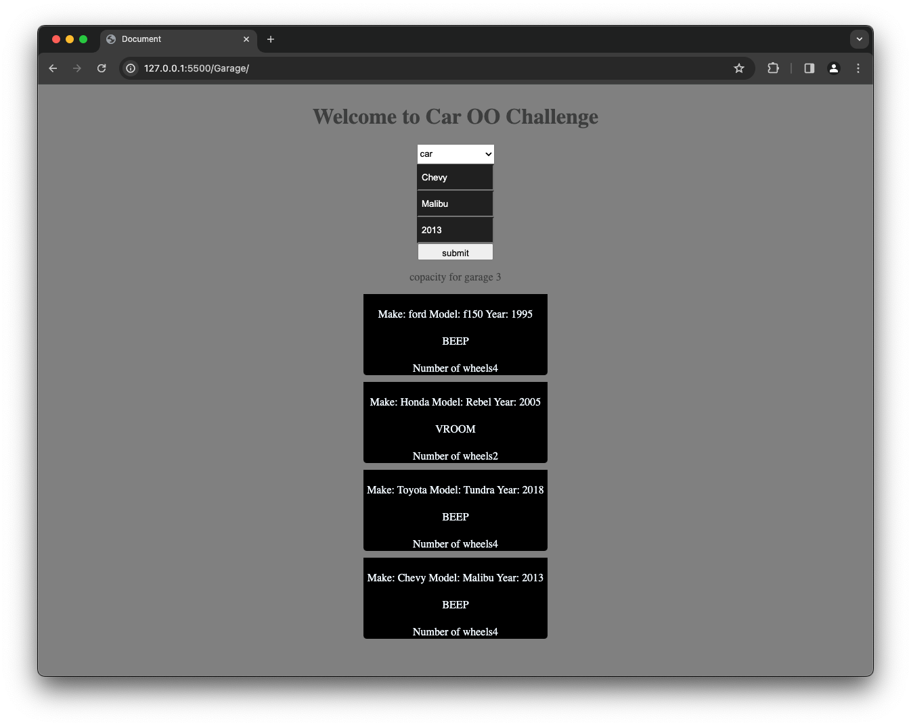

Introducing GarageMaster 3000: Your Ultimate Garage Management System! Whether you collect cars or motorcycles, GarageMaster 3000 has you covered. With customizable inventory and notification alerts for full capacity, it keeps your collection organized.

HOW TO RUN 
------------------------------------
* To get started, navigate to the Garage repository on GitHub and download the files. Then, open the folder in Visual Studio Code and launch the live server extension. This action  will automatically open the project in your default web browser.

TECHNOLOGY STACK USED
------------------------------------
* HTML
* CSS
* JavaScript

